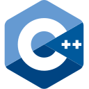

<h1 align="center">Hi there, I'm Nikita</a></h1>

# 👨‍💻 About me:

- Java Developer
- Graduated with a Specialist degree in IT (Cyber Security)
- Experienced in backend development, API design, and microservices architecture
- I'm wonder how everything works under the hood

<h2> StackOverflow</h2>

#  LeetCode Stats

# 🛠️ Language and Tools:

    
    
    
    
    
    
    
    
    

<!--
- 🔭 I’m currently working on ...
- 🌱 I’m currently learning ...
- 👯 I’m looking to collaborate on ...
- 🤔 I’m looking for help with ...
- 💬 Ask me about ...
- 📫 How to reach me: ...
- 😄 Pronouns: ...
- ⚡ Fun fact: ...

Search icons: https://devicon.dev/
-->
